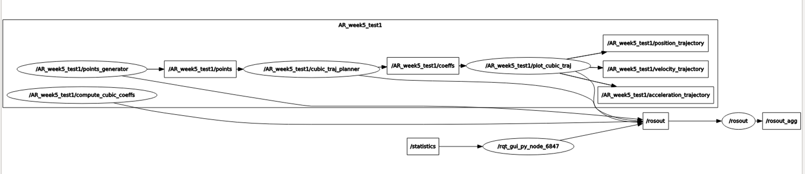

### Point-to-point cubic trajectories connecting pairs of randomly generated points in ROS:

ROS package that automatically generates point-to-point cubic trajectories connecting pairs of randomly generated points. After running a single launch file you should be able see different random trajectories appearing on the rqt_plot GUI (i.e. a different set of trajectories every 20 seconds).

### To run the package:

- Download the package into your catkin workspace, if you do not have a catkin workspace, follow the following [link](https://wiki.ros.org/catkin/Tutorials/create_a_workspace)

- From your catkin workspace:

  ```shell
  catkin_make
  ```

- After your workspace is ready, you need to make all of the nodes executable, run the following comands from the "scripts" folder containing all the nodes

  ```shell
  chmod +x plot_cubic_traj.py
  chmod +x points_generator.py
  chmod +x compute_cubic_coeffs.py
  chmod +x plot_cubic_traj.py
  ```

- You can now launch the package by running:

  ```shells
  roslaunch AR_week5_test cubic_traj_gen.launch
  ```

- After 20 seconds, if you run:

  ```
  rqt_graph
  ```

  You should be able to see the visual representation of how the package works:

<<<<<<< HEAD
   
=======
   
>>>>>>> e5a068150afc5e20f36f7697c7cc5d5865ea261e

- To visulise the trajectories, run: (don't forget to add position_trajectory, velocity_trajectory and acceleration_trajectory topics in the GUI)

- ```
  rqt_plot
  ```

### List of Dependencies:

- python 2.7
- catkin
- ros-kinetic
- rqt
- NumPy
